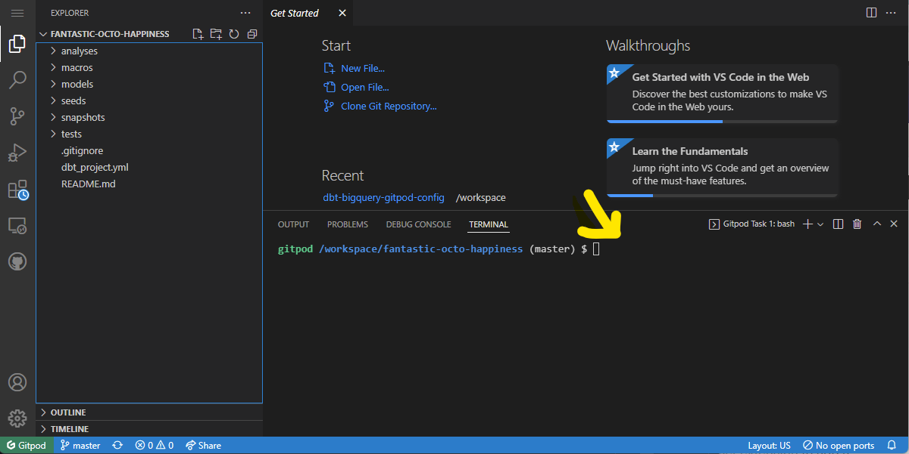
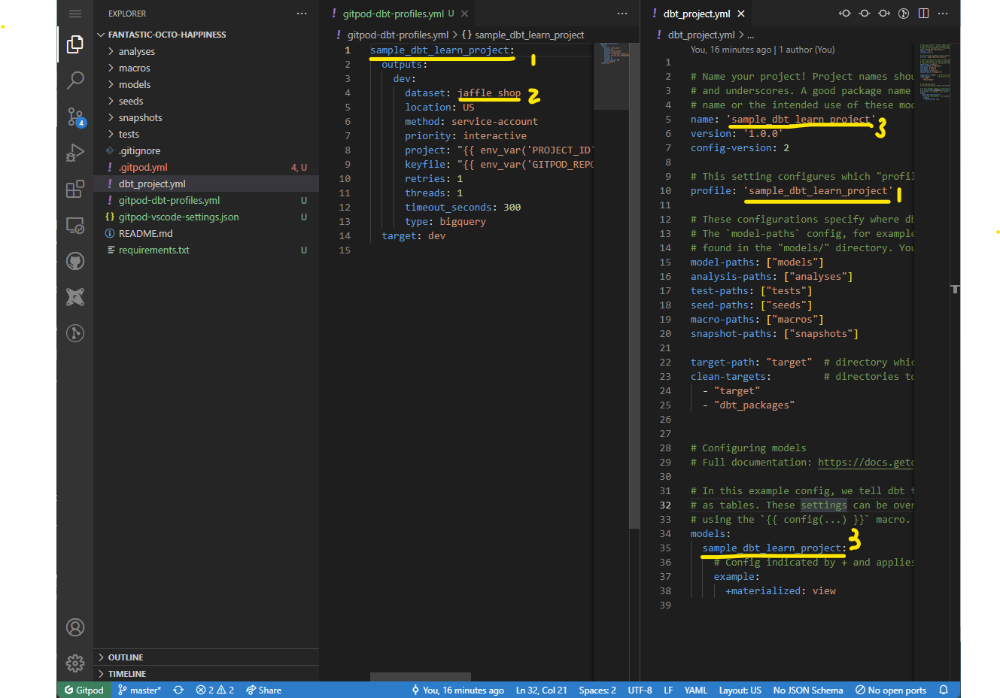
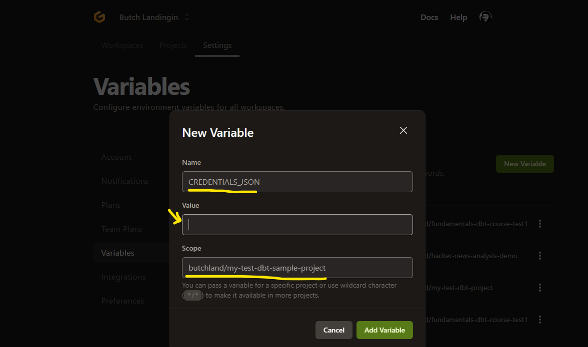
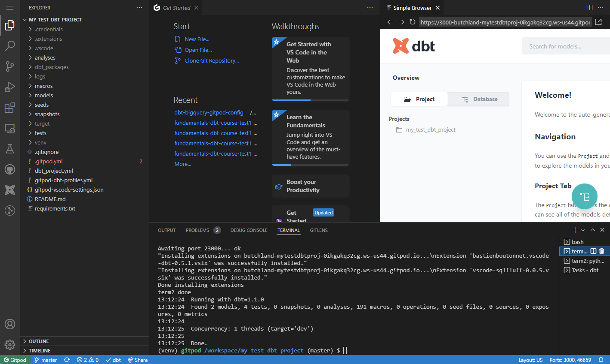
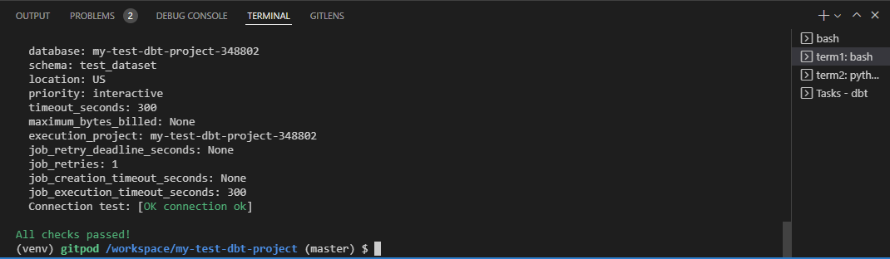

# Quickstart

## Prerequisites:

1) Github account ([signup](https://github.com/signup))
2) Google [account](https://accounts.google.com/signin) (for access to [Big Query](https://console.cloud.google.com/bigquery))
3) Gitpod.io  account ([signup](https://gitpod.io/workspaces))

## Steps

### Setup  GCP Big Query project and Github repo to open on Gitpod

1) [Create a Big Query (BQ) GCP Project](https://docs.getdbt.com/tutorial/getting-set-up/setting-up-bigquery#prerequisites) and download a **service account key credentials json file** with BQ access permissions. If you already have an existing **GCP BQ Project** but not a service account or a key credentials json file, [see these for instructions on creating one](https://cloud.google.com/iam/docs/creating-managing-service-account-keys). **Download and save this file in your local directory as you will need this later to setup your `gitpod.io` dbt workspace**.

1) (_Optional_) Install the Gitpod [Chrome](https://chrome.google.com/webstore/detail/gitpod-always-ready-to-co/dodmmooeoklaejobgleioelladacbeki)/[Brave](https://chrome.google.com/webstore/detail/gitpod-always-ready-to-co/dodmmooeoklaejobgleioelladacbeki)/[Firefox](https://addons.mozilla.org/en-US/firefox/addon/gitpod/) browser extension/addon. This will add a **Gitpod**  button on your main repository page that will conveniently open your github project in a `gitpod.io` workspace. 


1) If you already have an existing DBT project on github, open the github project in [gitpod.io](https://www.gitpod.io/workspaces) using the **Gitpod** button on your github page. _Note: You can also create a new branch or use an existing branch if you don't want to use the default branch to open in gitpod.io -- just add the `tree/<branch-name>` to end of the gitpod url_. 

1) If you don't have an existing dbt project but just want to try out using dbt on gitpod, create a new dbt project from an [existing dbt project template repository](https://github.com/butchland/sample-dbt-learn-project/generate). Then you can open this dbt project on gitpod.

1) As an alternative to clicking the gitpod button (i.e. you didn't install the browser extension), you can also open your github project in a gitpod workspace by using the url `https://gitpod.io/#<your-github-repo-url>` (if you are not using the main branch, you can append the name of the branch of the repo (`/tree/<branch-name>`) to the end of the url).

> Note: If your git repo is not hosted by Github, but is supported by gitpod (e.g. [bitbucket](https://www.gitpod.io/docs/bitbucket-integration) and [gitlab](https://www.gitpod.io/docs/gitlab-integration)), please follow [gitpod.io's instructions](https://www.gitpod.io/docs/integrations) on how to load those repos into your gitpod workspace.


## Configuring your dbt project environment in Gitpod.io



1) Run the following command in your gitpod **VS Code terminal** window. This script will copy over some configuration files (including a gitpod configuration file called `.gitpod.yml` ).

```
curl -s https://raw.githubusercontent.com/butchland/dbt-gitpod-config/main/scripts/loadconfig | bash
```

2) Edit the `gitpod-dbt-profiles.yml` configuration files to match your dbt profile. Make sure it is using the correct profile name (line 1) as the `profile`  property defined in your `dbt_project.yml` file. Also check that the `dataset` property is an existing BQ dataset in your GCP project. If you generated your dbt project from the [sample dbt template linked above](https://github.com/butchland/sample-dbt-learn-project/generate), they have been configured to match the default profile (`sample_dbt_learn_project`). Just make sure to create a `jaffle_shop` dataset in your GCP BQ project.



3) Create a [Gitpod workspace environment](https://gitpod.io/variables) variable named `CREDENTIALS_JSON` with the scope limited to the project (usually `<user-name>/<repo-name>`). Copy the contents of your **service account key credentials json file** (which you should have created in [step 1 of the Github and GCP BQ setup section](#setup-github-repo-and-gcp-project-to-open-on-gitpod)) into the value of the environment variable.



4) Commit your new changes into git (i.e. `git add`, `git commit` ) and do a `git push` to update your remote git repository.

5) **At this point, your dbt project is now configured for use in a gitpod workspace**. You can close and delete the [gitpod workspace instance](https://gitpod.io/workspaces) of your project (_since all the changes are now in your dbt project repo_).

### Opening and testing your dbt project environment in your Gitpod workspace



1) From your remote git repository web page, click the Gitpod button (if you installed the gitpod browser extension) or alternatively, open the url `https://gitpod.io/#<your-github-repo-url>`. 

2) With `.gitpod.yml` in your project root directory, gitpod will now run the set of commands in the `.gitpod.yml` file to configure your environment for use with dbt, including the setup of a virtual python environment, your dbt profile, as well as other steps such as installing a default set of vscode extensions to make your gitpod vscode editor a powerful dbt development environment. 

3) The first run takes a little bit longer than the usual, as it takes additional steps to use it for the first time. See the [gitpod documentation](https://www.gitpod.io/docs/getting-started#help-gitpod-understand-your-repository) regarding these steps.

4) If you have setup everything correctly (_including reloading the window to pickup the installation of the vscode extensions_), there should be a **VS Code**  browser showing the generated dbt documentation about your project.

5) You can setup the virtual environment `venv/bin/python` as default python interpreter to be used by project.

6) Open a new terminal and check if everything is setup correctly by running `dbt debug`. If should return an `OK Connection` success message.



7) You should now be able to run other `dbt` commands just like in a local dbt cli environment.

### Using the VS Code DBT Extensions

1) Open a model or analysis sql file. There should be additional navigational menu buttons in the top right provided by the **VS Code DBT Big Query Power User** extension. You can trigger model compilation or run the sql as well as preview the results. Opening the query runner button runs the sql and previews the results of the sql. For more information, [click here](https://open-vsx.org/extension/butchland/vscode-dbt-bigquery-power-user)


Lastly, several additional VS Code extensions that make your dbt development have also installed in your workspace environment:

* **[vscode-dbt](https://marketplace.visualstudio.com/items?itemName=bastienboutonnet.vscode-dbt)** - VSCode Snippet Package for jinja and dbt
* **[sqlfluff](https://marketplace.visualstudio.com/items?itemName=dorzey.vscode-sqlfluff)** - A linter and auto-formatter for SQLfluff, a popular linting tool for SQL and dbt

### Conclusion

At this point, you should have a pretty powerful and productive online development environment that can rival your local development environment. 

If you have comments or suggestions to improve this documentation, please file an [issue on the tracker](https://github.com/butchland/dbt-bigquery-gitpod-config/issues).


